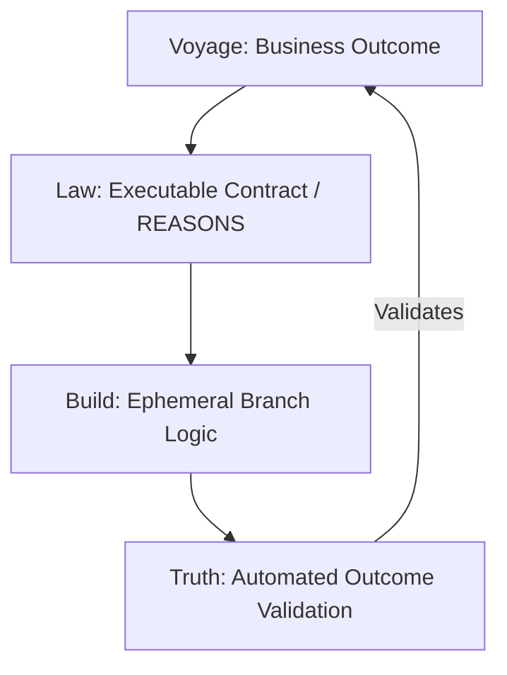

# o16g Ontological Reference Library: Citations Registry

This document serves as the official registry for the citation codes utilized throughout the `o16g Agentic SDK` documentation and manifests (such as `REASONS.md` and `FIRST_STEPS.md`). It links numeric ontological markers to their primary principles, philosophical foundations, and implementation directives.

---

## The Philosophy of Outcome Engineering
In an agentic software development model, code is an ephemeral byproduct. The central objective of `o16g` is to redirect human and AI capabilities away from traditional vanity metrics (lines of code, story points, hours spent) and toward the generation of real, verifiable business impact.

---

## Citation Registry Index

| Citation ID | Domain | Ontological Principle | Scope & Practical Guidance |
| :--- | :--- | :--- | :--- |
| **`[cite: 720]`** | The Voyage | Software is a Means to an End | Code has zero intrinsic value. We build systems exclusively to drive business outcome KPIs. |
| **`[cite: 722]`** | Core Axioms | Code is a Vanity Metric | Codebase size or velocity is irrelevant if it does not yield a measurable, positive change to the customer. |
| **`[cite: 728]`** | The Law | Spec-Driven Development (SDD) | The specification (REASONS Canvas) is the sole source of truth. Code must align 1-to-1 without feature drift. |
| **`[cite: 736]`** | The Truth | Review-Driven Development (RDD) | Validation criteria must directly verify the realization of the business intention. No PR is merged without RDD approval. |
| **`[cite: 1035]`**| Verification| Measurable Business Metrics | Standardizing quantitative goals (e.g., latency, cost per token, conversion rate) over standard test success. |

---

## Deep Dive: Citation Definitions

### `[cite: 720]` — Software is a Means to an End
> [!IMPORTANT]
> **Source:** *o16g Outcome Engineering Manifesto - Section 1.1 (The Voyage)*
> **Ontological Axiom:** "We do not engineer software; we engineer outcomes. Software is merely an implementation detail that can be discarded, rewritten, or optimized by agents at will."

*   **Context**: When defining the Voyage in `REASONS.md`, developers must avoid describing *how* to build the service and instead describe *why* it is being built.
*   **Enforcement**: The Reviewer Agent rejects any specification that defines technical details under "The Voyage" instead of clear business goals.

---

### `[cite: 722]` — Code is a Vanity Metric
> [!NOTE]
> **Source:** *o16g Core Axioms - Axiom 1: Outcome Engineering*
> **Ontological Axiom:** "Success is measured by realized business value, not by lines of code or closed tickets."

*   **Context**: Prevents developers and agents from celebrating massive PRs or refactors that have no correlation with target KPIs.
*   **Application**: Guides the agent to minimize structural footprint and prioritize the simplest, most performant solution to hit the metric.

---

### `[cite: 728]` — Spec-Driven Development (SDD)
> [!CAUTION]
> **Source:** *o16g Core Axioms - Axiom 2: The Law*
> **Ontological Axiom:** "The specification is the single source of truth, and the code is a disposable byproduct."

*   **Context**: Establishes that changes must occur in the specification (`REASONS.md`) first. The code is only regenerated after the intention has been formalized.
*   **Application**: If code is altered directly without updating the corresponding specification, the review system automatically locks the state with `[BLOCKED_DRIFT]`.

---

### `[cite: 736]` — Review-Driven Development (RDD)
> [!TIP]
> **Source:** *o16g Core Axioms - Axiom 3: The Truth*
> **Ontological Axiom:** "Quality is not a property added at the end, but a discipline that is cultivated through continuous validation."

*   **Context**: Emphasizes that validation criteria must be established *before* code is written, ensuring a clear path to verify the realization of the original intention.
*   **Application**: Requires robust automated testing (both functional and performance-based) that maps directly back to the acceptance criteria defined in the SDD phase.

---

### `[cite: 1035]` — Measurable Business Metrics
> [!IMPORTANT]
> **Source:** *o16g Operations and Verification Protocol - Clause 4.2*
> **Ontological Axiom:** "An outcome without a metric is merely a wish. All outcomes must chain to a measurable business KPI."

*   **Context**: Demands that every engineering effort is backed by real metrics, such as a 30% reduction in response time or maintaining a p99 latency < 100ms.
*   **Application**: Agents are instructed to run load and performance tests during their verification phase to validate metric alignment.
